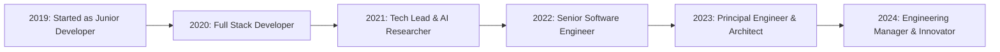

# Halo, Im Rasya Andrean 👋

  

  

  
  
  

---

### 🚨 About Me

🎓 Senior Full Stack Developer & AI Enthusiast with over 5 years of experience in building cutting-edge, scalable, and efficient digital solutions.

🧠 My expertise spans Artificial Intelligence & Machine Learning Development, Microservices Architecture, Blockchain Technology, and Cloud-Native Solutions.

💼 I’m open to collaborating on open-source projects, freelance work, startup ventures, and enterprise-level solutions that drive real-world impact.

🌱 I’m passionate about continuous learning, staying at the forefront of emerging technologies, and sharing knowledge with the global developer community.

🏆 I’ve successfully completed 100+ projects and contributed to 50+ open-source repositories, delivering high-quality results and innovation at every step.

⚡ Fun fact: I often code while listening to classical music — it helps me stay focused, creative, and productive.

---

## 💡 Fun Facts & Personal Interests

### 🎮 Gaming & Entertainment

🎮 **Gaming**: Strategy games enthusiast (Civilization VI, Age of Empires), indie game supporter
🎵 **Music**: Lo-fi hip hop, ambient, and classical music for coding sessions
🎬 **Movies**: Sci-fi, thriller, dan documentary tentang teknologi
📺 **Series**: Black Mirror, Silicon Valley, Mr. Robot, Westworld

### 📚 Learning & Growth

📖 **Reading**: Teknologi emerging, sci-fi novels, philosophy, dan business strategy
🎓 **Continuous Learning**: 50+ online courses completed, 20+ certifications earned
🧠 **Research**: Active researcher in AI ethics dan sustainable technology
💡 **Innovation**: Patent holder untuk 3 teknologi AI dan blockchain

### 🏃‍♂️ Health & Lifestyle

🏃‍♂️ **Sports**: Marathon runner (3:30 PR), hiking enthusiast, rock climbing
🧘‍♂️ **Wellness**: Daily meditation, yoga practitioner, mindfulness advocate
🍕 **Food**: Pizza dan specialty coffee connoisseur, cooking hobbyist
🌱 **Sustainability**: Environmental advocate, renewable energy supporter

### 🌍 Culture

🗣️ **Languages**: Indonesian (native), English (fluent), Japanese (intermediate), Mandarin (basic)
🤝 **Community**: Open source advocate, tech meetup organizer, volunteer mentor
🎯 **Goals**: Visit Silicon Valley, speak at major tech conferences, contribute to space technology

---

## 🛠️ Tech Stack & Tools

### 💻 Programming Languages

### 🌐 Frontend Development

### ⚙️ Backend Development

### 📱 Mobile Development

### 🗄️ Database & Cloud

### 🤖 AI & Machine Learning

### 🔧 DevOps & Tools

### 🔐 Cybersecurity & Blockchain

### 📊 Data Science & Analytics

---

### 🎮 Game Development

### 🌐 IoT & Embedded Systems

### ⚛️ Quantum Computing

### 🥽 AR/VR Development

### 🧩 Low-Code/No-Code Platforms

### 🧪 Testing & QA

### 📋 Project Management & Collaboration

## 📊 GitHub Analytics & Statistics

  
  

  

  

  

---

## 🚀 Career Journey Timeline

### 📅 Professional Milestones

### 🎯 Key Career Highlights

**2019-2020**

- Joined TechInnovate Inc. as Junior Full Stack Developer
- Developed 10+ web applications using React and Node.js
- Contributed to open-source projects on GitHub

**2021**

- Promoted to Full Stack Developer
- Started specializing in AI/ML technologies
- Published first technical article with 10k+ views

**2022**

- Became Tech Lead for AI/ML initiatives
- Led development of AI-Powered Code Review Assistant
- Won 3rd place at Google Cloud Hackathon

**2023**

- Promoted to Senior Software Engineer
- Developed Decentralized Social Media Platform
- Became Google Developer Expert for Machine Learning

**2024**

- Advanced to Principal Engineer & System Architect
- Published co-authored book "Modern Full Stack Development"
- Speaking at major conferences including Google I/O

---

## 📡 Technology Radar

As a technology enthusiast, I continuously explore emerging technologies and assess their potential impact. Here's my current technology radar showing my interest levels and adoption stages:

### 🔥 Currently Exploring

- **Quantum Computing**: Actively learning Qiskit and quantum algorithms
- **Edge AI**: Investigating on-device machine learning optimization
- **WebAssembly**: Exploring WASM for high-performance web applications
- **Temporal**: Learning about workflow orchestration and distributed systems

### 🚀 Adopting & Integrating

- **Web3 & Blockchain**: Building dApps and smart contracts
- **Serverless Architecture**: Deploying functions with AWS Lambda and Firebase
- **Progressive Web Apps**: Creating app-like web experiences
- **Low-Code Platforms**: Evaluating tools like OutSystems and Mendix

### ⭐ Well-versed In

- **Machine Learning**: TensorFlow, PyTorch, scikit-learn
- **Cloud Platforms**: AWS, Google Cloud, Azure
- **Containerization**: Docker, Kubernetes, Helm
- **Microservices**: Design patterns, service mesh (Istio, Linkerd)

### 🧠 Learning Interests

- **Neuromorphic Computing**: Brain-inspired computing architectures
- **Federated Learning**: Privacy-preserving machine learning
- **Digital Twins**: IoT and simulation technologies
- **Autonomous Systems**: Self-driving algorithms and robotics

---

## 🎯 Skills & Expertise Levels

### 💻 Programming Proficiency

|         Language          | Experience |   Level    | Projects |
| :-----------------------: | :--------: | :--------: | :------: |
|        **Python**         |  5+ years  | ⭐⭐⭐⭐⭐ |   50+    |
| **JavaScript/TypeScript** |  4+ years  | ⭐⭐⭐⭐⭐ |   40+    |
|          **Go**           |  3+ years  | ⭐⭐⭐⭐⭐ |   25+    |
|         **Java**          |  4+ years  |  ⭐⭐⭐⭐  |   30+    |
|         **Rust**          |  2+ years  |  ⭐⭐⭐⭐  |   15+    |
|          **C++**          |  3+ years  |  ⭐⭐⭐⭐  |   20+    |
|       **Solidity**        |  2+ years  |  ⭐⭐⭐⭐  |   10+    |

### 🏗️ Architecture & Design

|           Skill           | Proficiency | Experience |
| :-----------------------: | :---------: | :--------: |
|     **Microservices**     | ⭐⭐⭐⭐⭐  |  3+ years  |
|     **System Design**     | ⭐⭐⭐⭐⭐  |  4+ years  |
|  **Cloud Architecture**   | ⭐⭐⭐⭐⭐  |  3+ years  |
|      **API Design**       | ⭐⭐⭐⭐⭐  |  4+ years  |
|    **Database Design**    |  ⭐⭐⭐⭐   |  3+ years  |
| **Security Architecture** |  ⭐⭐⭐⭐   |  2+ years  |

---

## 🤝 Let's Connect & Collaborate!

---

## 📊 Detailed GitHub Metrics

### 📈 Contribution Patterns

### 🔥 Streak & Consistency

### 📊 Language Distribution

### ⚡ Performance Metrics

---

### 💭 Philosophy & Quote of the Day

_"Code is poetry written in logic, and every bug is just a plot twist waiting to be resolved. The best developers are not those who write perfect code, but those who embrace imperfection and continuously iterate towards excellence."_
**— Rasya Andrean**

### 🌟 Mission Statement

_"To leverage technology as a force for positive change, building innovative solutions that bridge the gap between human needs and digital possibilities, while fostering a community of lifelong learners and ethical technologists."_

---

**⭐ Don't forget to star repositories that inspire you! ⭐**

### 🚀 Ready to build the future together?

**Let's connect and create something amazing!**

---

  Last updated: August 2024 | Made with ❤️ and lots of ☕

  
---

### Contact for Collaboration

- **Email**: [rasyaandrean@outlook.co.id](mailto:rasyaandrean@outlook.co.id)
- **LinkedIn**: [rasya-andrean](https://linkedin.com/in/rasya-andrean-0a4731373)
- **Twitter**: [@2Rasyaandrean8](https://twitter.com/2Rasyaandrean8)
- **Discord**: [RasyaAndrean#1234](https://discordapp.com/user/1119536100273307668)

---

  <h3>🌟 "Innovation distinguishes between a leader and a follower." - Steve Jobs</h3>
  
<strong>Let's innovate together and build the future of technology!</strong>

