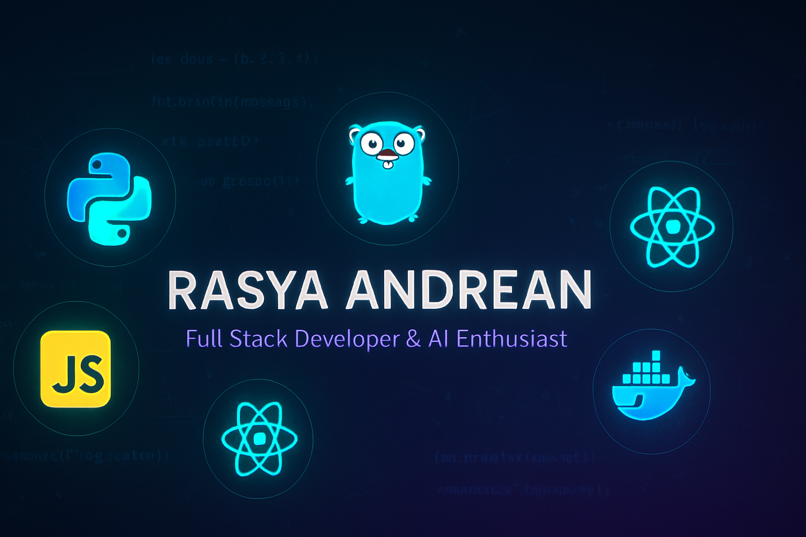

  

  

  
  
  

---

# 👋 Hi, I'm Rasya Andrean

Senior **Full-Stack Developer & Software Engineer** with 5+ years of experience building scalable, secure, and high-performance systems.

Specialized in **cloud-native architecture**, **microservices**, **AI/ML integration**, and **security-focused engineering**.

Open to collaboration on **open-source**, **freelance**, **startup**, and **enterprise-level** projects.

---

## 💼 Core Expertise

- 🌐 Full-Stack Web & API Development
- 🏗️ System Design & Microservices Architecture
- 🤖 AI / Machine Learning Applications
- ☁️ Cloud, DevOps & Infrastructure Automation
- 🔒 Cybersecurity & Blockchain Solutions

---

## 🧰 Tech Stack

**Languages**  

**Frontend**  

**Backend**  

**Data & Cloud**  

**DevOps**  

**AI/ML**  

---

## 📊 GitHub Statistics

  
  

  
  

## 🏆 GitHub Achievements

  

## 📈 Contribution Activity

  

---

## 🤝 Let's Connect

  

---

  
### 💭 *"Build systems that scale, ship fast, and stay secure."*

**⭐ If you find my projects helpful, consider giving them a star!**

