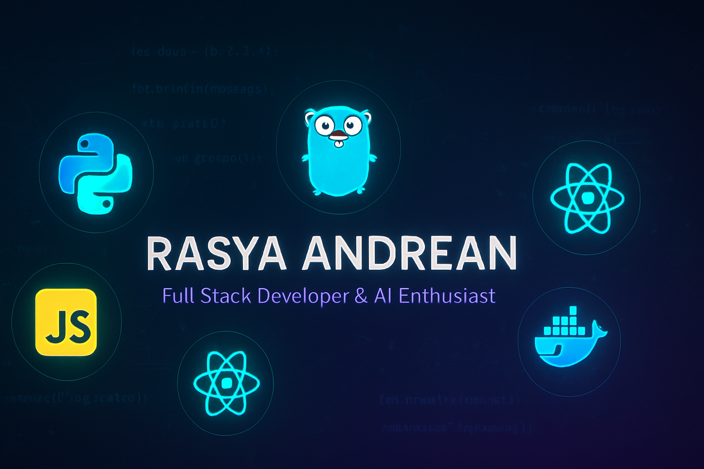

<div align="center">
  
</div>

<br/>

<div align="center">
  
</div>

<div align="center">
  <a href="https://www.rasyaandrean.my.id"></a>
  <a href="https://linkedin.com/in/rasyaandrean"></a>
  <a href="https://x.com/2Rasyaandrean8"></a>
  <a href="https://t.me/rasyaandrean"></a>
  <a href="mailto:rasyaandrean@outlook.co.id"></a>
</div>

<br/>

<div align="center">
  
  
  
</div>

---

<div align="center">
  <h3>Software Engineer focused on building scalable, secure, and intelligent systems</h3>
  <p><i>Exploring cloud computing, automation, blockchain, and open-source innovation</i></p>
</div>

---

### About Me

```
Name       :  Rasya Andrean
Location   :  Indonesia
Experience :  5+ Years in Software Engineering & Cybersecurity
Current    :  Lead Developer  |  Lead Penetration Tester  |  IT Advisor
Focus      :  Distributed Systems, AI/ML, Cloud-Native, Blockchain
```

A developer and AI enthusiast with more than five years of experience. The career journey started as a junior developer, grew into a senior developer role, and eventually led to taking on responsibilities as a **Lead Developer**. Experienced in building systems from the ground up and bringing them into production, with a strong focus on clean design, scalability, and long-term maintainability.

Actively involved in both **front-end** and **back-end** development, with a strong interest in **AI/ML**, **microservices**, **cloud-native systems**, and **blockchain integration**. Frequently contributes to architectural decisions, system improvements, and aligning technical solutions with product and business needs.

> *"Code is poetry written in logic, and every bug is just a plot twist waiting to be resolved."*

---

### Career Timeline

```
2025 - Now    Lead Penetration Tester    ████████████████████  Defining testing strategies & leading security programs
2022 - Now    Lead Developer (Tech Lead) ████████████████████  Leading AI/ML initiatives & cross-functional teams
2022 - Now    IT Advisor                 ████████████████████  Strategic & technical guidance for IT systems
2022 - 2024   Senior Penetration Tester  ██████████████████    Advanced security assessments & vulnerability analysis
2021 - 2021   Senior Developer           ████████              AI/ML integration & scalable architecture
2019 - 2021   Junior Penetration Tester  ██████████████        Security testing on web apps & networks
2019 - 2020   Junior Developer           ████████              Full-stack web development & open-source contributions
```

---

### Core Expertise

<table>
<tr>
<td align="center" width="25%">

**Full-Stack Development**

Web & API development, system design, microservices architecture, CI/CD pipelines

</td>
<td align="center" width="25%">

**AI & Machine Learning**

Intelligent automation, predictive analytics, ML model development, AI-powered tools

</td>
<td align="center" width="25%">

**Cybersecurity**

Penetration testing, OWASP Top 10, vulnerability analysis, security assessments

</td>
<td align="center" width="25%">

**Cloud & DevOps**

Cloud-native systems, containerization, infrastructure automation, distributed systems

</td>
</tr>
</table>

---

### Tech Stack

<table>
<tr>
<td align="center" width="18%"><b>Languages</b></td>
<td>


</td>
</tr>
<tr>
<td align="center"><b>Frontend</b></td>
<td>


</td>
</tr>
<tr>
<td align="center"><b>Backend</b></td>
<td>


</td>
</tr>
<tr>
<td align="center"><b>AI / ML</b></td>
<td>


</td>
</tr>
<tr>
<td align="center"><b>Database & Cloud</b></td>
<td>


</td>
</tr>
<tr>
<td align="center"><b>DevOps & Tools</b></td>
<td>


</td>
</tr>
<tr>
<td align="center"><b>Security</b></td>
<td>


</td>
</tr>
</table>

---

### Featured Projects

| Project | Description | Tech |
|---------|-------------|------|
| [**DAXX-AI**](https://github.com/RasyaAndrean/DAXX-AI) | Modern AI assistant application | React, Vite, Tailwind CSS |
| [**Local-To-Port**](https://github.com/RasyaAndrean/Local-To-Port) | VS Code extension for instant port forwarding | TypeScript |
| [**Universal-Encryption-System**](https://github.com/RasyaAndrean/Universal-Encryption-System) | Rust-based file encryption tool | Rust |
| [**Binary-Data-Engine**](https://github.com/RasyaAndrean/Binary-Data-Engine) | Lightweight engine for binary data processing | C# |
| [**Reverse-Engineering**](https://github.com/RasyaAndrean/Reverse-Engineering) | Reverse engineering research & learning journey | C, Assembly |
| [**Assembly-Code-Examples**](https://github.com/RasyaAndrean/Assembly-Code-Examples) | Organized assembly language examples collection | Assembly |
| [**CONFESS**](https://github.com/RasyaAndrean/CONFESS) | Anonymous messaging web application | HTML, CSS, JS |
| [**MiniLink**](https://github.com/RasyaAndrean/MiniLink) | Minimalist & modern URL shortener | HTML, CSS, JS |
| [**Laravel-Code-Examples**](https://github.com/RasyaAndrean/Laravel-Code-Examples) | Complete Laravel learning resource | PHP, Laravel |
| [**The-Most-Complete-Calculator**](https://github.com/RasyaAndrean/The-Most-Complete-Calculator) | Comprehensive calculator with scientific & financial features | JavaScript |

---

### GitHub Stats

<div align="center">
  
  
</div>

<br/>

<div align="center">
  
</div>

---

### Trophies

<div align="center">

[](https://github.com/ryo-ma/github-profile-trophy)

</div>

---

### Contribution Activity

<div align="center">
  
</div>

---

<div align="center">
  
</div>

<div align="center">
  <b>Open to collaboration on open-source projects, freelance work, startup development, and large-scale solutions.</b>
  <br/><br/>
  <a href="https://www.rasyaandrean.my.id"></a>
  <a href="https://linkedin.com/in/rasyaandrean"></a>
</div>
